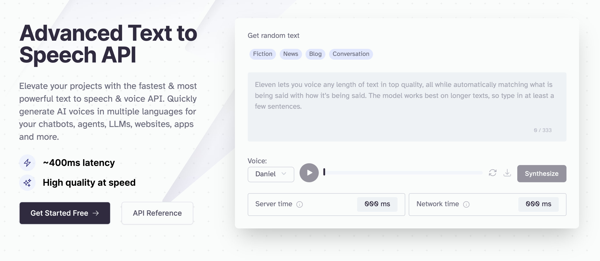

<div align="left">

[](https://elevenlabs.com)

# Elevenlabs<a id="elevenlabs"></a>

This is the documentation for the ElevenLabs API. You can use this API to use our service programmatically, this is done by using your xi-api-key. <br/> You can view your xi-api-key using the 'Profile' tab on https://elevenlabs.io. Our API is experimental so all endpoints are subject to change.


</div>

## Table of Contents<a id="table-of-contents"></a>

<!-- toc -->

- [Requirements](#requirements)
- [Installation](#installation)
- [Getting Started](#getting-started)
- [Async](#async)
- [Raw HTTP Response](#raw-http-response)
- [Reference](#reference)
  * [`elevenlabs.pronunciation_dictionary.create_from_file`](#elevenlabspronunciation_dictionarycreate_from_file)
  * [`elevenlabs.pronunciation_dictionary.get_metadata`](#elevenlabspronunciation_dictionaryget_metadata)
  * [`elevenlabs.audio_native.create_project_with_embeddable_html`](#elevenlabsaudio_nativecreate_project_with_embeddable_html)
  * [`elevenlabs.dubbing.delete_project`](#elevenlabsdubbingdelete_project)
  * [`elevenlabs.dubbing.file_in_language`](#elevenlabsdubbingfile_in_language)
  * [`elevenlabs.dubbing.get_file`](#elevenlabsdubbingget_file)
  * [`elevenlabs.dubbing.get_project_metadata`](#elevenlabsdubbingget_project_metadata)
  * [`elevenlabs.models.list_available_models`](#elevenlabsmodelslist_available_models)
  * [`elevenlabs.projects.create_new_project`](#elevenlabsprojectscreate_new_project)
  * [`elevenlabs.projects.delete_by_id`](#elevenlabsprojectsdelete_by_id)
  * [`elevenlabs.projects.delete_chapter_by_id`](#elevenlabsprojectsdelete_chapter_by_id)
  * [`elevenlabs.projects.get_all_projects`](#elevenlabsprojectsget_all_projects)
  * [`elevenlabs.projects.get_by_id`](#elevenlabsprojectsget_by_id)
  * [`elevenlabs.projects.get_chapter_by_id`](#elevenlabsprojectsget_chapter_by_id)
  * [`elevenlabs.projects.get_chapter_snapshots`](#elevenlabsprojectsget_chapter_snapshots)
  * [`elevenlabs.projects.list_chapters`](#elevenlabsprojectslist_chapters)
  * [`elevenlabs.projects.list_snapshots`](#elevenlabsprojectslist_snapshots)
  * [`elevenlabs.projects.start_chapter_conversion`](#elevenlabsprojectsstart_chapter_conversion)
  * [`elevenlabs.projects.start_conversion`](#elevenlabsprojectsstart_conversion)
  * [`elevenlabs.projects.stream_audio_from_snapshot`](#elevenlabsprojectsstream_audio_from_snapshot)
  * [`elevenlabs.projects.stream_audio_from_snapshot_post`](#elevenlabsprojectsstream_audio_from_snapshot_post)
  * [`elevenlabs.projects.update_pronunciation_dictionaries`](#elevenlabsprojectsupdate_pronunciation_dictionaries)
  * [`elevenlabs.redirect.to_mintlify_docs_get`](#elevenlabsredirectto_mintlify_docs_get)
  * [`elevenlabs.samples.get_audio_from_sample`](#elevenlabssamplesget_audio_from_sample)
  * [`elevenlabs.samples.remove_by_id`](#elevenlabssamplesremove_by_id)
  * [`elevenlabs.speech_history.delete_history_item_by_id`](#elevenlabsspeech_historydelete_history_item_by_id)
  * [`elevenlabs.speech_history.download_history_items`](#elevenlabsspeech_historydownload_history_items)
  * [`elevenlabs.speech_history.get_generated_audio_metadata`](#elevenlabsspeech_historyget_generated_audio_metadata)
  * [`elevenlabs.speech_history.get_history_item_audio`](#elevenlabsspeech_historyget_history_item_audio)
  * [`elevenlabs.speech_history.get_history_item_by_id`](#elevenlabsspeech_historyget_history_item_by_id)
  * [`elevenlabs.speech_to_speech.create_with_voice`](#elevenlabsspeech_to_speechcreate_with_voice)
  * [`elevenlabs.speech_to_speech.create_with_voice_0`](#elevenlabsspeech_to_speechcreate_with_voice_0)
  * [`elevenlabs.text_to_speech.convert_text_to_speech`](#elevenlabstext_to_speechconvert_text_to_speech)
  * [`elevenlabs.text_to_speech.convert_text_to_speech_stream`](#elevenlabstext_to_speechconvert_text_to_speech_stream)
  * [`elevenlabs.user.get_info`](#elevenlabsuserget_info)
  * [`elevenlabs.user.get_subscription_info`](#elevenlabsuserget_subscription_info)
  * [`elevenlabs.voice_generation.create_voice`](#elevenlabsvoice_generationcreate_voice)
  * [`elevenlabs.voice_generation.generate_random_voice`](#elevenlabsvoice_generationgenerate_random_voice)
  * [`elevenlabs.voice_generation.get_voice_generation_parameters`](#elevenlabsvoice_generationget_voice_generation_parameters)
  * [`elevenlabs.voices.add_to_collection`](#elevenlabsvoicesadd_to_collection)
  * [`elevenlabs.voices.add_voice_to_collection`](#elevenlabsvoicesadd_voice_to_collection)
  * [`elevenlabs.voices.delete_by_id`](#elevenlabsvoicesdelete_by_id)
  * [`elevenlabs.voices.edit_settings_post`](#elevenlabsvoicesedit_settings_post)
  * [`elevenlabs.voices.get_default_voice_settings`](#elevenlabsvoicesget_default_voice_settings)
  * [`elevenlabs.voices.get_settings`](#elevenlabsvoicesget_settings)
  * [`elevenlabs.voices.get_shared_voices`](#elevenlabsvoicesget_shared_voices)
  * [`elevenlabs.voices.get_voice_metadata`](#elevenlabsvoicesget_voice_metadata)
  * [`elevenlabs.voices.list_all_voices`](#elevenlabsvoiceslist_all_voices)
  * [`elevenlabs.voices.update_voice_by_id`](#elevenlabsvoicesupdate_voice_by_id)
  * [`elevenlabs.workspace.get_sso_provider_admin`](#elevenlabsworkspaceget_sso_provider_admin)

<!-- tocstop -->

## Requirements<a id="requirements"></a>

Python >=3.7

## Installation<a id="installation"></a>
<div align="center">
  <a href="https://konfigthis.com/sdk-sign-up?company=ElevenLabs&language=Python">
    
  </a>
</div>

## Getting Started<a id="getting-started"></a>

```python
from pprint import pprint
from eleven_labs_python_sdk import ElevenLabs, ApiException

elevenlabs = ElevenLabs()

try:
    # Add A Pronunciation Dictionary
    create_from_file_response = elevenlabs.pronunciation_dictionary.create_from_file(
        name="string_example",
        xi_api_key="string_example",
        description="string_example",
        file=open("/path/to/file", "rb"),
    )
    print(create_from_file_response)
except ApiException as e:
    print(
        "Exception when calling PronunciationDictionaryApi.create_from_file: %s\n" % e
    )
    pprint(e.body)
    if e.status == 422:
        pprint(e.body["detail"])
    pprint(e.headers)
    pprint(e.status)
    pprint(e.reason)
    pprint(e.round_trip_time)
```

## Async<a id="async"></a>

`async` support is available by prepending `a` to any method.

```python
import asyncio
from pprint import pprint
from eleven_labs_python_sdk import ElevenLabs, ApiException

elevenlabs = ElevenLabs()


async def main():
    try:
        # Add A Pronunciation Dictionary
        create_from_file_response = (
            await elevenlabs.pronunciation_dictionary.acreate_from_file(
                name="string_example",
                xi_api_key="string_example",
                description="string_example",
                file=open("/path/to/file", "rb"),
            )
        )
        print(create_from_file_response)
    except ApiException as e:
        print(
            "Exception when calling PronunciationDictionaryApi.create_from_file: %s\n"
            % e
        )
        pprint(e.body)
        if e.status == 422:
            pprint(e.body["detail"])
        pprint(e.headers)
        pprint(e.status)
        pprint(e.reason)
        pprint(e.round_trip_time)


asyncio.run(main())
```

## Raw HTTP Response<a id="raw-http-response"></a>

To access raw HTTP response values, use the `.raw` namespace.

```python
from pprint import pprint
from eleven_labs_python_sdk import ElevenLabs, ApiException

elevenlabs = ElevenLabs()

try:
    # Add A Pronunciation Dictionary
    create_from_file_response = (
        elevenlabs.pronunciation_dictionary.raw.create_from_file(
            name="string_example",
            xi_api_key="string_example",
            description="string_example",
            file=open("/path/to/file", "rb"),
        )
    )
    pprint(create_from_file_response.body)
    pprint(create_from_file_response.body["id"])
    pprint(create_from_file_response.body["name"])
    pprint(create_from_file_response.body["created_by"])
    pprint(create_from_file_response.body["creation_time_unix"])
    pprint(create_from_file_response.body["version_id"])
    pprint(create_from_file_response.body["description"])
    pprint(create_from_file_response.headers)
    pprint(create_from_file_response.status)
    pprint(create_from_file_response.round_trip_time)
except ApiException as e:
    print(
        "Exception when calling PronunciationDictionaryApi.create_from_file: %s\n" % e
    )
    pprint(e.body)
    if e.status == 422:
        pprint(e.body["detail"])
    pprint(e.headers)
    pprint(e.status)
    pprint(e.reason)
    pprint(e.round_trip_time)
```


## Reference<a id="reference"></a>
### `elevenlabs.pronunciation_dictionary.create_from_file`<a id="elevenlabspronunciation_dictionarycreate_from_file"></a>

Creates a new pronunciation dictionary from a lexicon .PLS file

#### 🛠️ Usage<a id="🛠️-usage"></a>

```python
create_from_file_response = elevenlabs.pronunciation_dictionary.create_from_file(
    name="string_example",
    xi_api_key="string_example",
    description="string_example",
    file=open("/path/to/file", "rb"),
)
```

#### ⚙️ Parameters<a id="⚙️-parameters"></a>

##### name: `str`<a id="name-str"></a>

The name of the pronunciation dictionary, used for identification only.

##### xi_api_key: `str`<a id="xi_api_key-str"></a>

Your API key. This is required by most endpoints to access our API programatically. You can view your xi-api-key using the 'Profile' tab on the website.

##### description: `str`<a id="description-str"></a>

A description of the pronunciation dictionary, used for identification only.

##### file: `IO`<a id="file-io"></a>

A lexicon .pls file which we will use to initialize the project with.

#### ⚙️ Request Body<a id="⚙️-request-body"></a>

[`BodyAddAPronunciationDictionaryV1PronunciationDictionariesAddFromFilePost`](./eleven_labs_python_sdk/type/body_add_a_pronunciation_dictionary_v1_pronunciation_dictionaries_add_from_file_post.py)
#### 🔄 Return<a id="🔄-return"></a>

[`AddPronunciationDictionaryResponseModel`](./eleven_labs_python_sdk/pydantic/add_pronunciation_dictionary_response_model.py)

#### 🌐 Endpoint<a id="🌐-endpoint"></a>

`/v1/pronunciation-dictionaries/add-from-file` `post`

[🔙 **Back to Table of Contents**](#table-of-contents)

---

### `elevenlabs.pronunciation_dictionary.get_metadata`<a id="elevenlabspronunciation_dictionaryget_metadata"></a>

Get metadata for a pronunciation dictionary

#### 🛠️ Usage<a id="🛠️-usage"></a>

```python
get_metadata_response = elevenlabs.pronunciation_dictionary.get_metadata(
    pronunciation_dictionary_id="21m00Tcm4TlvDq8ikWAM",
    xi_api_key="string_example",
)
```

#### ⚙️ Parameters<a id="⚙️-parameters"></a>

##### pronunciation_dictionary_id: `str`<a id="pronunciation_dictionary_id-str"></a>

The id of the pronunciation dictionary

##### xi_api_key: `str`<a id="xi_api_key-str"></a>

Your API key. This is required by most endpoints to access our API programatically. You can view your xi-api-key using the 'Profile' tab on the website.

#### 🔄 Return<a id="🔄-return"></a>

[`GetPronunciationDictionaryMetadataResponseModel`](./eleven_labs_python_sdk/pydantic/get_pronunciation_dictionary_metadata_response_model.py)

#### 🌐 Endpoint<a id="🌐-endpoint"></a>

`/v1/pronunciation-dictionaries/{pronunciation_dictionary_id}` `get`

[🔙 **Back to Table of Contents**](#table-of-contents)

---

### `elevenlabs.audio_native.create_project_with_embeddable_html`<a id="elevenlabsaudio_nativecreate_project_with_embeddable_html"></a>

Creates AudioNative enabled project, optionally starts conversion and returns project id and embeddable html snippet.

#### 🛠️ Usage<a id="🛠️-usage"></a>

```python
create_project_with_embeddable_html_response = (
    elevenlabs.audio_native.create_project_with_embeddable_html(
        name="string_example",
        file=open("/path/to/file", "rb"),
        xi_api_key="string_example",
        title="string_example",
        image="string_example",
        author="string_example",
        small=False,
        text_color="string_example",
        background_color="string_example",
        sessionization=0,
        voice_id="string_example",
        model_id="string_example",
        auto_convert=False,
    )
)
```

#### ⚙️ Parameters<a id="⚙️-parameters"></a>

##### name: `str`<a id="name-str"></a>

Project name.

##### file: `IO`<a id="file-io"></a>

Either txt or HTML input file containing the article content. HTML should be formatted as follows '&lt;html&gt;&lt;body&gt;&lt;div&gt;&lt;p&gt;Your content&lt;/p&gt;&lt;h5&gt;More of your content&lt;/h5&gt;&lt;p&gt;Some more of your content&lt;/p&gt;&lt;/div&gt;&lt;/body&gt;&lt;/html&gt;'

##### xi_api_key: `str`<a id="xi_api_key-str"></a>

Your API key. This is required by most endpoints to access our API programatically. You can view your xi-api-key using the 'Profile' tab on the website.

##### title: `str`<a id="title-str"></a>

Title used in the player and inserted at the top of the uploaded article. If not provided, the default title set in the Player settings is used.

##### image: `str`<a id="image-str"></a>

Image URL used in the player. If not provided, default image set in the Player settings is used.

##### author: `str`<a id="author-str"></a>

Author used in the player and inserted at the start of the uploaded article. If not provided, the default author set in the Player settings is used.

##### small: `bool`<a id="small-bool"></a>

Whether to use small player or not. If not provided, default value set in the Player settings is used.

##### text_color: `str`<a id="text_color-str"></a>

Text color used in the player. If not provided, default text color set in the Player settings is used.

##### background_color: `str`<a id="background_color-str"></a>

Background color used in the player. If not provided, default background color set in the Player settings is used.

##### sessionization: `int`<a id="sessionization-int"></a>

Specifies for how many minutes to persist the session across page reloads. If not provided, default sessionization set in the Player settings is used.

##### voice_id: `str`<a id="voice_id-str"></a>

Voice ID used to voice the content. If not provided, default voice ID set in the Player settings is used.

##### model_id: `str`<a id="model_id-str"></a>

TTS Model ID used in the player. If not provided, default model ID set in the Player settings is used.

##### auto_convert: `bool`<a id="auto_convert-bool"></a>

Whether to auto convert the project to audio or not.

#### ⚙️ Request Body<a id="⚙️-request-body"></a>

[`BodyCreatesAudioNativeEnabledProjectV1AudioNativePost`](./eleven_labs_python_sdk/type/body_creates_audio_native_enabled_project_v1_audio_native_post.py)
#### 🔄 Return<a id="🔄-return"></a>

[`AudioNativeCreateProjectResponseModel`](./eleven_labs_python_sdk/pydantic/audio_native_create_project_response_model.py)

#### 🌐 Endpoint<a id="🌐-endpoint"></a>

`/v1/audio-native` `post`

[🔙 **Back to Table of Contents**](#table-of-contents)

---

### `elevenlabs.dubbing.delete_project`<a id="elevenlabsdubbingdelete_project"></a>

Deletes a dubbing project.

#### 🛠️ Usage<a id="🛠️-usage"></a>

```python
delete_project_response = elevenlabs.dubbing.delete_project(
    dubbing_id="dubbing_id_example",
    xi_api_key="string_example",
)
```

#### ⚙️ Parameters<a id="⚙️-parameters"></a>

##### dubbing_id: `str`<a id="dubbing_id-str"></a>

ID of the dubbing project.

##### xi_api_key: `str`<a id="xi_api_key-str"></a>

Your API key. This is required by most endpoints to access our API programatically. You can view your xi-api-key using the 'Profile' tab on the website.

#### 🌐 Endpoint<a id="🌐-endpoint"></a>

`/v1/dubbing/{dubbing_id}` `delete`

[🔙 **Back to Table of Contents**](#table-of-contents)

---

### `elevenlabs.dubbing.file_in_language`<a id="elevenlabsdubbingfile_in_language"></a>

Dubs provided audio or video file into given language.

#### 🛠️ Usage<a id="🛠️-usage"></a>

```python
file_in_language_response = elevenlabs.dubbing.file_in_language(
    target_lang="string_example",
    xi_api_key="string_example",
    mode="string_example",
    file=open("/path/to/file", "rb"),
    csv_file=open("/path/to/file", "rb"),
    foreground_audio_file=open("/path/to/file", "rb"),
    background_audio_file=open("/path/to/file", "rb"),
    name="string_example",
    source_url="string_example",
    source_lang="auto",
    num_speakers=0,
    watermark=False,
    start_time=1,
    end_time=1,
    highest_resolution=False,
    dubbing_studio=False,
)
```

#### ⚙️ Parameters<a id="⚙️-parameters"></a>

##### target_lang: `str`<a id="target_lang-str"></a>

Target language.

##### xi_api_key: `str`<a id="xi_api_key-str"></a>

Your API key. This is required by most endpoints to access our API programatically. You can view your xi-api-key using the 'Profile' tab on the website.

##### mode: `str`<a id="mode-str"></a>

automatic or manual.

##### file: `IO`<a id="file-io"></a>

One or more audio files to clone the voice from

##### csv_file: `IO`<a id="csv_file-io"></a>

CSV file containing transcription/translation metadata

##### foreground_audio_file: `IO`<a id="foreground_audio_file-io"></a>

For use only with csv input

##### background_audio_file: `IO`<a id="background_audio_file-io"></a>

For use only with csv input

##### name: `str`<a id="name-str"></a>

Name of the dubbing project.

##### source_url: `str`<a id="source_url-str"></a>

URL of the source video/audio file.

##### source_lang: `str`<a id="source_lang-str"></a>

Source language.

##### num_speakers: `int`<a id="num_speakers-int"></a>

Number of speakers to use for the dubbing.

##### watermark: `bool`<a id="watermark-bool"></a>

Whether to apply watermark to the output video.

##### start_time: `int`<a id="start_time-int"></a>

Start time of the source video/audio file.

##### end_time: `int`<a id="end_time-int"></a>

End time of the source video/audio file.

##### highest_resolution: `bool`<a id="highest_resolution-bool"></a>

Whether to use the highest resolution available.

##### dubbing_studio: `bool`<a id="dubbing_studio-bool"></a>

Whether to prepare dub for edits in dubbing studio.

#### ⚙️ Request Body<a id="⚙️-request-body"></a>

[`BodyDubAVideoOrAnAudioFileV1DubbingPost`](./eleven_labs_python_sdk/type/body_dub_a_video_or_an_audio_file_v1_dubbing_post.py)
#### 🔄 Return<a id="🔄-return"></a>

[`DoDubbingResponseModel`](./eleven_labs_python_sdk/pydantic/do_dubbing_response_model.py)

#### 🌐 Endpoint<a id="🌐-endpoint"></a>

`/v1/dubbing` `post`

[🔙 **Back to Table of Contents**](#table-of-contents)

---

### `elevenlabs.dubbing.get_file`<a id="elevenlabsdubbingget_file"></a>

Returns dubbed file as a streamed file. Videos will be returned in MP4 format and audio only dubs will be returned in MP3.

#### 🛠️ Usage<a id="🛠️-usage"></a>

```python
elevenlabs.dubbing.get_file(
    dubbing_id="dubbing_id_example",
    language_code="language_code_example",
    xi_api_key="string_example",
)
```

#### ⚙️ Parameters<a id="⚙️-parameters"></a>

##### dubbing_id: `str`<a id="dubbing_id-str"></a>

ID of the dubbing project.

##### language_code: `str`<a id="language_code-str"></a>

ID of the language.

##### xi_api_key: `str`<a id="xi_api_key-str"></a>

Your API key. This is required by most endpoints to access our API programatically. You can view your xi-api-key using the 'Profile' tab on the website.

#### 🌐 Endpoint<a id="🌐-endpoint"></a>

`/v1/dubbing/{dubbing_id}/audio/{language_code}` `get`

[🔙 **Back to Table of Contents**](#table-of-contents)

---

### `elevenlabs.dubbing.get_project_metadata`<a id="elevenlabsdubbingget_project_metadata"></a>

Returns metadata about a dubbing project, including whether it's still in progress or not

#### 🛠️ Usage<a id="🛠️-usage"></a>

```python
get_project_metadata_response = elevenlabs.dubbing.get_project_metadata(
    dubbing_id="dubbing_id_example",
    xi_api_key="string_example",
)
```

#### ⚙️ Parameters<a id="⚙️-parameters"></a>

##### dubbing_id: `str`<a id="dubbing_id-str"></a>

ID of the dubbing project.

##### xi_api_key: `str`<a id="xi_api_key-str"></a>

Your API key. This is required by most endpoints to access our API programatically. You can view your xi-api-key using the 'Profile' tab on the website.

#### 🔄 Return<a id="🔄-return"></a>

[`DubbingMetadataResponse`](./eleven_labs_python_sdk/pydantic/dubbing_metadata_response.py)

#### 🌐 Endpoint<a id="🌐-endpoint"></a>

`/v1/dubbing/{dubbing_id}` `get`

[🔙 **Back to Table of Contents**](#table-of-contents)

---

### `elevenlabs.models.list_available_models`<a id="elevenlabsmodelslist_available_models"></a>

Gets a list of available models.

#### 🛠️ Usage<a id="🛠️-usage"></a>

```python
list_available_models_response = elevenlabs.models.list_available_models(
    xi_api_key="string_example",
)
```

#### ⚙️ Parameters<a id="⚙️-parameters"></a>

##### xi_api_key: `str`<a id="xi_api_key-str"></a>

Your API key. This is required by most endpoints to access our API programatically. You can view your xi-api-key using the 'Profile' tab on the website.

#### 🔄 Return<a id="🔄-return"></a>

[`ModelsListAvailableModelsResponse`](./eleven_labs_python_sdk/pydantic/models_list_available_models_response.py)

#### 🌐 Endpoint<a id="🌐-endpoint"></a>

`/v1/models` `get`

[🔙 **Back to Table of Contents**](#table-of-contents)

---

### `elevenlabs.projects.create_new_project`<a id="elevenlabsprojectscreate_new_project"></a>

Creates a new project, it can be either initialized as blank, from a document or from a URL.

#### 🛠️ Usage<a id="🛠️-usage"></a>

```python
create_new_project_response = elevenlabs.projects.create_new_project(
    name="string_example",
    default_title_voice_id="string_example",
    default_paragraph_voice_id="string_example",
    default_model_id="string_example",
    pronunciation_dictionary_locators=["string_example"],
    xi_api_key="string_example",
    title="string_example",
    from_url="string_example",
    from_document=open("/path/to/file", "rb"),
    quality_preset="standard",
    author="string_example",
    isbn_number="string_example",
    acx_volume_normalization=False,
    volume_normalization=False,
    callback_url="string_example",
)
```

#### ⚙️ Parameters<a id="⚙️-parameters"></a>

##### name: `str`<a id="name-str"></a>

The name of the project, used for identification only.

##### default_title_voice_id: `str`<a id="default_title_voice_id-str"></a>

The voice_id that corresponds to the default voice used for new titles.

##### default_paragraph_voice_id: `str`<a id="default_paragraph_voice_id-str"></a>

The voice_id that corresponds to the default voice used for new paragraphs.

##### default_model_id: `str`<a id="default_model_id-str"></a>

The model_id of the model to be used for this project, you can query GET https://api.elevenlabs.io/v1/models to list all available models.

##### pronunciation_dictionary_locators: [`BodyAddProjectV1ProjectsAddPostPronunciationDictionaryLocators`](./eleven_labs_python_sdk/type/body_add_project_v1_projects_add_post_pronunciation_dictionary_locators.py)<a id="pronunciation_dictionary_locators-bodyaddprojectv1projectsaddpostpronunciationdictionarylocatorseleven_labs_python_sdktypebody_add_project_v1_projects_add_post_pronunciation_dictionary_locatorspy"></a>

##### xi_api_key: `str`<a id="xi_api_key-str"></a>

Your API key. This is required by most endpoints to access our API programatically. You can view your xi-api-key using the 'Profile' tab on the website.

##### title: `str`<a id="title-str"></a>

An optional name of the author of the project, this will be added as metadata to the mp3 file on project / chapter download.

##### from_url: `str`<a id="from_url-str"></a>

An optional URL from which we will extract content to initialize the project. If this is set, 'from_url' must be null. If neither 'from_url' or 'from_document' are provided we will initialize the project as blank.

##### from_document: `IO`<a id="from_document-io"></a>

An optional .epub, .pdf, .txt or similar file can be provided. If provided, we will initialize the project with its content. If this is set, 'from_url' must be null.  If neither 'from_url' or 'from_document' are provided we will initialize the project as blank.

##### quality_preset: `str`<a id="quality_preset-str"></a>

Output quality of the generated audio. Must be one of: standard - standard output format, 128kbps with 44.1kHz sample rate. high - high quality output format, 192kbps with 44.1kHz sample rate and major improvements on our side. Using this setting increases the character cost by 20%. ultra - ultra quality output format, 192kbps with 44.1kHz sample rate and highest improvements on our side. Using this setting increases the character cost by 50%. 

##### author: `str`<a id="author-str"></a>

An optional name of the author of the project, this will be added as metadata to the mp3 file on project / chapter download.

##### isbn_number: `str`<a id="isbn_number-str"></a>

An optional ISBN number of the project you want to create, this will be added as metadata to the mp3 file on project / chapter download.

##### acx_volume_normalization: `bool`<a id="acx_volume_normalization-bool"></a>

[Deprecated] When the project is downloaded, should the returned audio have postprocessing in order to make it compliant with audiobook normalized volume requirements

##### volume_normalization: `bool`<a id="volume_normalization-bool"></a>

When the project is downloaded, should the returned audio have postprocessing in order to make it compliant with audiobook normalized volume requirements

##### callback_url: `str`<a id="callback_url-str"></a>

A url that will be called by our service when the project is converted with a json containing the status of the conversion

#### ⚙️ Request Body<a id="⚙️-request-body"></a>

[`BodyAddProjectV1ProjectsAddPost`](./eleven_labs_python_sdk/type/body_add_project_v1_projects_add_post.py)
#### 🔄 Return<a id="🔄-return"></a>

[`AddProjectResponseModel`](./eleven_labs_python_sdk/pydantic/add_project_response_model.py)

#### 🌐 Endpoint<a id="🌐-endpoint"></a>

`/v1/projects/add` `post`

[🔙 **Back to Table of Contents**](#table-of-contents)

---

### `elevenlabs.projects.delete_by_id`<a id="elevenlabsprojectsdelete_by_id"></a>

Delete a project by its project_id.

#### 🛠️ Usage<a id="🛠️-usage"></a>

```python
delete_by_id_response = elevenlabs.projects.delete_by_id(
    project_id="21m00Tcm4TlvDq8ikWAM",
    xi_api_key="string_example",
)
```

#### ⚙️ Parameters<a id="⚙️-parameters"></a>

##### project_id: `str`<a id="project_id-str"></a>

The project_id of the project, you can query GET https://api.elevenlabs.io/v1/projects to list all available projects.

##### xi_api_key: `str`<a id="xi_api_key-str"></a>

Your API key. This is required by most endpoints to access our API programatically. You can view your xi-api-key using the 'Profile' tab on the website.

#### 🌐 Endpoint<a id="🌐-endpoint"></a>

`/v1/projects/{project_id}` `delete`

[🔙 **Back to Table of Contents**](#table-of-contents)

---

### `elevenlabs.projects.delete_chapter_by_id`<a id="elevenlabsprojectsdelete_chapter_by_id"></a>

Delete a chapter by its chapter_id.

#### 🛠️ Usage<a id="🛠️-usage"></a>

```python
delete_chapter_by_id_response = elevenlabs.projects.delete_chapter_by_id(
    project_id="21m00Tcm4TlvDq8ikWAM",
    chapter_id="21m00Tcm4TlvDq8ikWAM",
    xi_api_key="string_example",
)
```

#### ⚙️ Parameters<a id="⚙️-parameters"></a>

##### project_id: `str`<a id="project_id-str"></a>

The project_id of the project, you can query GET https://api.elevenlabs.io/v1/projects to list all available projects.

##### chapter_id: `str`<a id="chapter_id-str"></a>

The chapter_id of the chapter. You can query GET https://api.elevenlabs.io/v1/projects/{project_id}/chapters to list all available chapters for a project.

##### xi_api_key: `str`<a id="xi_api_key-str"></a>

Your API key. This is required by most endpoints to access our API programatically. You can view your xi-api-key using the 'Profile' tab on the website.

#### 🌐 Endpoint<a id="🌐-endpoint"></a>

`/v1/projects/{project_id}/chapters/{chapter_id}` `delete`

[🔙 **Back to Table of Contents**](#table-of-contents)

---

### `elevenlabs.projects.get_all_projects`<a id="elevenlabsprojectsget_all_projects"></a>

Returns a list of your projects together and its metadata.

#### 🛠️ Usage<a id="🛠️-usage"></a>

```python
get_all_projects_response = elevenlabs.projects.get_all_projects(
    xi_api_key="string_example",
)
```

#### ⚙️ Parameters<a id="⚙️-parameters"></a>

##### xi_api_key: `str`<a id="xi_api_key-str"></a>

Your API key. This is required by most endpoints to access our API programatically. You can view your xi-api-key using the 'Profile' tab on the website.

#### 🔄 Return<a id="🔄-return"></a>

[`GetProjectsResponseModel`](./eleven_labs_python_sdk/pydantic/get_projects_response_model.py)

#### 🌐 Endpoint<a id="🌐-endpoint"></a>

`/v1/projects` `get`

[🔙 **Back to Table of Contents**](#table-of-contents)

---

### `elevenlabs.projects.get_by_id`<a id="elevenlabsprojectsget_by_id"></a>

Returns information about a specific project. This endpoint returns more detailed information about a project than GET api.elevenlabs.io/v1/projects.

#### 🛠️ Usage<a id="🛠️-usage"></a>

```python
get_by_id_response = elevenlabs.projects.get_by_id(
    project_id="21m00Tcm4TlvDq8ikWAM",
    xi_api_key="string_example",
)
```

#### ⚙️ Parameters<a id="⚙️-parameters"></a>

##### project_id: `str`<a id="project_id-str"></a>

The project_id of the project, you can query GET https://api.elevenlabs.io/v1/projects to list all available projects.

##### xi_api_key: `str`<a id="xi_api_key-str"></a>

Your API key. This is required by most endpoints to access our API programatically. You can view your xi-api-key using the 'Profile' tab on the website.

#### 🔄 Return<a id="🔄-return"></a>

[`ProjectExtendedResponseModel`](./eleven_labs_python_sdk/pydantic/project_extended_response_model.py)

#### 🌐 Endpoint<a id="🌐-endpoint"></a>

`/v1/projects/{project_id}` `get`

[🔙 **Back to Table of Contents**](#table-of-contents)

---

### `elevenlabs.projects.get_chapter_by_id`<a id="elevenlabsprojectsget_chapter_by_id"></a>

Returns information about a specific chapter.

#### 🛠️ Usage<a id="🛠️-usage"></a>

```python
get_chapter_by_id_response = elevenlabs.projects.get_chapter_by_id(
    project_id="21m00Tcm4TlvDq8ikWAM",
    chapter_id="21m00Tcm4TlvDq8ikWAM",
    xi_api_key="string_example",
)
```

#### ⚙️ Parameters<a id="⚙️-parameters"></a>

##### project_id: `str`<a id="project_id-str"></a>

The project_id of the project, you can query GET https://api.elevenlabs.io/v1/projects to list all available projects.

##### chapter_id: `str`<a id="chapter_id-str"></a>

The chapter_id of the chapter. You can query GET https://api.elevenlabs.io/v1/projects/{project_id}/chapters to list all available chapters for a project.

##### xi_api_key: `str`<a id="xi_api_key-str"></a>

Your API key. This is required by most endpoints to access our API programatically. You can view your xi-api-key using the 'Profile' tab on the website.

#### 🔄 Return<a id="🔄-return"></a>

[`ChapterResponseModel`](./eleven_labs_python_sdk/pydantic/chapter_response_model.py)

#### 🌐 Endpoint<a id="🌐-endpoint"></a>

`/v1/projects/{project_id}/chapters/{chapter_id}` `get`

[🔙 **Back to Table of Contents**](#table-of-contents)

---

### `elevenlabs.projects.get_chapter_snapshots`<a id="elevenlabsprojectsget_chapter_snapshots"></a>

Gets information about all the snapshots of a chapter, each snapshot corresponds can be downloaded as audio. Whenever a chapter is converted a snapshot will be automatically created.

#### 🛠️ Usage<a id="🛠️-usage"></a>

```python
get_chapter_snapshots_response = elevenlabs.projects.get_chapter_snapshots(
    project_id="21m00Tcm4TlvDq8ikWAM",
    chapter_id="21m00Tcm4TlvDq8ikWAM",
    xi_api_key="string_example",
)
```

#### ⚙️ Parameters<a id="⚙️-parameters"></a>

##### project_id: `str`<a id="project_id-str"></a>

The project_id of the project, you can query GET https://api.elevenlabs.io/v1/projects to list all available projects.

##### chapter_id: `str`<a id="chapter_id-str"></a>

The chapter_id of the chapter. You can query GET https://api.elevenlabs.io/v1/projects/{project_id}/chapters to list all available chapters for a project.

##### xi_api_key: `str`<a id="xi_api_key-str"></a>

Your API key. This is required by most endpoints to access our API programatically. You can view your xi-api-key using the 'Profile' tab on the website.

#### 🔄 Return<a id="🔄-return"></a>

[`ChapterSnapshotsResponseModel`](./eleven_labs_python_sdk/pydantic/chapter_snapshots_response_model.py)

#### 🌐 Endpoint<a id="🌐-endpoint"></a>

`/v1/projects/{project_id}/chapters/{chapter_id}/snapshots` `get`

[🔙 **Back to Table of Contents**](#table-of-contents)

---

### `elevenlabs.projects.list_chapters`<a id="elevenlabsprojectslist_chapters"></a>

Returns a list of your chapters for a project together and its metadata.

#### 🛠️ Usage<a id="🛠️-usage"></a>

```python
list_chapters_response = elevenlabs.projects.list_chapters(
    project_id="21m00Tcm4TlvDq8ikWAM",
    xi_api_key="string_example",
)
```

#### ⚙️ Parameters<a id="⚙️-parameters"></a>

##### project_id: `str`<a id="project_id-str"></a>

The project_id of the project, you can query GET https://api.elevenlabs.io/v1/projects to list all available projects.

##### xi_api_key: `str`<a id="xi_api_key-str"></a>

Your API key. This is required by most endpoints to access our API programatically. You can view your xi-api-key using the 'Profile' tab on the website.

#### 🔄 Return<a id="🔄-return"></a>

[`GetChaptersResponseModel`](./eleven_labs_python_sdk/pydantic/get_chapters_response_model.py)

#### 🌐 Endpoint<a id="🌐-endpoint"></a>

`/v1/projects/{project_id}/chapters` `get`

[🔙 **Back to Table of Contents**](#table-of-contents)

---

### `elevenlabs.projects.list_snapshots`<a id="elevenlabsprojectslist_snapshots"></a>

Gets the snapshots of a project.

#### 🛠️ Usage<a id="🛠️-usage"></a>

```python
list_snapshots_response = elevenlabs.projects.list_snapshots(
    project_id="21m00Tcm4TlvDq8ikWAM",
    xi_api_key="string_example",
)
```

#### ⚙️ Parameters<a id="⚙️-parameters"></a>

##### project_id: `str`<a id="project_id-str"></a>

The project_id of the project, you can query GET https://api.elevenlabs.io/v1/projects to list all available projects.

##### xi_api_key: `str`<a id="xi_api_key-str"></a>

Your API key. This is required by most endpoints to access our API programatically. You can view your xi-api-key using the 'Profile' tab on the website.

#### 🔄 Return<a id="🔄-return"></a>

[`ProjectSnapshotsResponseModel`](./eleven_labs_python_sdk/pydantic/project_snapshots_response_model.py)

#### 🌐 Endpoint<a id="🌐-endpoint"></a>

`/v1/projects/{project_id}/snapshots` `get`

[🔙 **Back to Table of Contents**](#table-of-contents)

---

### `elevenlabs.projects.start_chapter_conversion`<a id="elevenlabsprojectsstart_chapter_conversion"></a>

Starts conversion of a specific chapter.

#### 🛠️ Usage<a id="🛠️-usage"></a>

```python
start_chapter_conversion_response = elevenlabs.projects.start_chapter_conversion(
    project_id="21m00Tcm4TlvDq8ikWAM",
    chapter_id="21m00Tcm4TlvDq8ikWAM",
    xi_api_key="string_example",
)
```

#### ⚙️ Parameters<a id="⚙️-parameters"></a>

##### project_id: `str`<a id="project_id-str"></a>

The project_id of the project, you can query GET https://api.elevenlabs.io/v1/projects to list all available projects.

##### chapter_id: `str`<a id="chapter_id-str"></a>

The chapter_id of the chapter. You can query GET https://api.elevenlabs.io/v1/projects/{project_id}/chapters to list all available chapters for a project.

##### xi_api_key: `str`<a id="xi_api_key-str"></a>

Your API key. This is required by most endpoints to access our API programatically. You can view your xi-api-key using the 'Profile' tab on the website.

#### 🌐 Endpoint<a id="🌐-endpoint"></a>

`/v1/projects/{project_id}/chapters/{chapter_id}/convert` `post`

[🔙 **Back to Table of Contents**](#table-of-contents)

---

### `elevenlabs.projects.start_conversion`<a id="elevenlabsprojectsstart_conversion"></a>

Starts conversion of a project and all of its chapters.

#### 🛠️ Usage<a id="🛠️-usage"></a>

```python
start_conversion_response = elevenlabs.projects.start_conversion(
    project_id="21m00Tcm4TlvDq8ikWAM",
    xi_api_key="string_example",
)
```

#### ⚙️ Parameters<a id="⚙️-parameters"></a>

##### project_id: `str`<a id="project_id-str"></a>

The project_id of the project, you can query GET https://api.elevenlabs.io/v1/projects to list all available projects.

##### xi_api_key: `str`<a id="xi_api_key-str"></a>

Your API key. This is required by most endpoints to access our API programatically. You can view your xi-api-key using the 'Profile' tab on the website.

#### 🌐 Endpoint<a id="🌐-endpoint"></a>

`/v1/projects/{project_id}/convert` `post`

[🔙 **Back to Table of Contents**](#table-of-contents)

---

### `elevenlabs.projects.stream_audio_from_snapshot`<a id="elevenlabsprojectsstream_audio_from_snapshot"></a>

Stream the audio from a project snapshot.

#### 🛠️ Usage<a id="🛠️-usage"></a>

```python
elevenlabs.projects.stream_audio_from_snapshot(
    project_id="21m00Tcm4TlvDq8ikWAM",
    project_snapshot_id="21m00Tcm4TlvDq8ikWAM",
    xi_api_key="string_example",
)
```

#### ⚙️ Parameters<a id="⚙️-parameters"></a>

##### project_id: `str`<a id="project_id-str"></a>

The project_id of the project, you can query GET https://api.elevenlabs.io/v1/projects to list all available projects.

##### project_snapshot_id: `str`<a id="project_snapshot_id-str"></a>

The project_snapshot_id of the project snapshot. You can query GET /v1/projects/{project_id}/snapshots to list all available snapshots for a project.

##### xi_api_key: `str`<a id="xi_api_key-str"></a>

Your API key. This is required by most endpoints to access our API programatically. You can view your xi-api-key using the 'Profile' tab on the website.

#### 🌐 Endpoint<a id="🌐-endpoint"></a>

`/v1/projects/{project_id}/snapshots/{project_snapshot_id}/stream` `post`

[🔙 **Back to Table of Contents**](#table-of-contents)

---

### `elevenlabs.projects.stream_audio_from_snapshot_post`<a id="elevenlabsprojectsstream_audio_from_snapshot_post"></a>

Stream the audio from a chapter snapshot. Use GET /v1/projects/{project_id}/chapters/{chapter_id}/snapshots to return the chapter snapshots of a chapter.

#### 🛠️ Usage<a id="🛠️-usage"></a>

```python
elevenlabs.projects.stream_audio_from_snapshot_post(
    project_id="21m00Tcm4TlvDq8ikWAM",
    chapter_id="21m00Tcm4TlvDq8ikWAM",
    chapter_snapshot_id="21m00Tcm4TlvDq8ikWAM",
    xi_api_key="string_example",
)
```

#### ⚙️ Parameters<a id="⚙️-parameters"></a>

##### project_id: `str`<a id="project_id-str"></a>

The project_id of the project, you can query GET https://api.elevenlabs.io/v1/projects to list all available projects.

##### chapter_id: `str`<a id="chapter_id-str"></a>

The chapter_id of the chapter. You can query GET https://api.elevenlabs.io/v1/projects/{project_id}/chapters to list all available chapters for a project.

##### chapter_snapshot_id: `str`<a id="chapter_snapshot_id-str"></a>

The chapter_snapshot_id of the chapter snapshot. You can query GET /v1/projects/{project_id}/chapters/{chapter_id}/snapshots to the all available snapshots for a chapter.

##### xi_api_key: `str`<a id="xi_api_key-str"></a>

Your API key. This is required by most endpoints to access our API programatically. You can view your xi-api-key using the 'Profile' tab on the website.

#### 🌐 Endpoint<a id="🌐-endpoint"></a>

`/v1/projects/{project_id}/chapters/{chapter_id}/snapshots/{chapter_snapshot_id}/stream` `post`

[🔙 **Back to Table of Contents**](#table-of-contents)

---

### `elevenlabs.projects.update_pronunciation_dictionaries`<a id="elevenlabsprojectsupdate_pronunciation_dictionaries"></a>

Updates the set of pronunciation dictionaries acting on a project. This will automatically mark text within this project as requiring reconverting where the new dictionary would apply or the old one no longer does.

#### 🛠️ Usage<a id="🛠️-usage"></a>

```python
update_pronunciation_dictionaries_response = (
    elevenlabs.projects.update_pronunciation_dictionaries(
        pronunciation_dictionary_locators=[
            {
                "pronunciation_dictionary_id": "pronunciation_dictionary_id_example",
                "version_id": "version_id_example",
            }
        ],
        project_id="21m00Tcm4TlvDq8ikWAM",
        xi_api_key="string_example",
    )
)
```

#### ⚙️ Parameters<a id="⚙️-parameters"></a>

##### pronunciation_dictionary_locators: List[`PronunciationDictionaryVersionLocatorDBModel`]<a id="pronunciation_dictionary_locators-listpronunciationdictionaryversionlocatordbmodel"></a>

A list of pronunciation dictionary locators (id, version_id) encoded as a list of JSON strings for pronunciation dictionaries to be applied to the text.  A list of json encoded strings is required as adding projects may occur through formData as opposed to jsonBody

##### project_id: `str`<a id="project_id-str"></a>

The project_id of the project, you can query GET https://api.elevenlabs.io/v1/projects to list all available projects.

##### xi_api_key: `str`<a id="xi_api_key-str"></a>

Your API key. This is required by most endpoints to access our API programatically. You can view your xi-api-key using the 'Profile' tab on the website.

#### ⚙️ Request Body<a id="⚙️-request-body"></a>

[`BodyUpdatePronunciationDictionariesV1ProjectsProjectIdUpdatePronunciationDictionariesPost`](./eleven_labs_python_sdk/type/body_update_pronunciation_dictionaries_v1_projects_project_id_update_pronunciation_dictionaries_post.py)
#### 🌐 Endpoint<a id="🌐-endpoint"></a>

`/v1/projects/{project_id}/update-pronunciation-dictionaries` `post`

[🔙 **Back to Table of Contents**](#table-of-contents)

---

### `elevenlabs.redirect.to_mintlify_docs_get`<a id="elevenlabsredirectto_mintlify_docs_get"></a>

Redirect To Mintlify

#### 🛠️ Usage<a id="🛠️-usage"></a>

```python
to_mintlify_docs_get_response = elevenlabs.redirect.to_mintlify_docs_get()
```

#### 🌐 Endpoint<a id="🌐-endpoint"></a>

`/docs` `get`

[🔙 **Back to Table of Contents**](#table-of-contents)

---

### `elevenlabs.samples.get_audio_from_sample`<a id="elevenlabssamplesget_audio_from_sample"></a>

Returns the audio corresponding to a sample attached to a voice.

#### 🛠️ Usage<a id="🛠️-usage"></a>

```python
elevenlabs.samples.get_audio_from_sample(
    voice_id="21m00Tcm4TlvDq8ikWAM",
    sample_id="VW7YKqPnjY4h39yTbx2L",
    xi_api_key="string_example",
)
```

#### ⚙️ Parameters<a id="⚙️-parameters"></a>

##### voice_id: `str`<a id="voice_id-str"></a>

Voice ID to be used, you can use https://api.elevenlabs.io/v1/voices to list all the available voices.

##### sample_id: `str`<a id="sample_id-str"></a>

Sample ID to be used, you can use GET https://api.elevenlabs.io/v1/voices/{voice_id} to list all the available samples for a voice.

##### xi_api_key: `str`<a id="xi_api_key-str"></a>

Your API key. This is required by most endpoints to access our API programatically. You can view your xi-api-key using the 'Profile' tab on the website.

#### 🌐 Endpoint<a id="🌐-endpoint"></a>

`/v1/voices/{voice_id}/samples/{sample_id}/audio` `get`

[🔙 **Back to Table of Contents**](#table-of-contents)

---

### `elevenlabs.samples.remove_by_id`<a id="elevenlabssamplesremove_by_id"></a>

Removes a sample by its ID.

#### 🛠️ Usage<a id="🛠️-usage"></a>

```python
remove_by_id_response = elevenlabs.samples.remove_by_id(
    voice_id="21m00Tcm4TlvDq8ikWAM",
    sample_id="VW7YKqPnjY4h39yTbx2L",
    xi_api_key="string_example",
)
```

#### ⚙️ Parameters<a id="⚙️-parameters"></a>

##### voice_id: `str`<a id="voice_id-str"></a>

Voice ID to be used, you can use https://api.elevenlabs.io/v1/voices to list all the available voices.

##### sample_id: `str`<a id="sample_id-str"></a>

Sample ID to be used, you can use GET https://api.elevenlabs.io/v1/voices/{voice_id} to list all the available samples for a voice.

##### xi_api_key: `str`<a id="xi_api_key-str"></a>

Your API key. This is required by most endpoints to access our API programatically. You can view your xi-api-key using the 'Profile' tab on the website.

#### 🌐 Endpoint<a id="🌐-endpoint"></a>

`/v1/voices/{voice_id}/samples/{sample_id}` `delete`

[🔙 **Back to Table of Contents**](#table-of-contents)

---

### `elevenlabs.speech_history.delete_history_item_by_id`<a id="elevenlabsspeech_historydelete_history_item_by_id"></a>

Delete a history item by its ID

#### 🛠️ Usage<a id="🛠️-usage"></a>

```python
delete_history_item_by_id_response = (
    elevenlabs.speech_history.delete_history_item_by_id(
        history_item_id="VW7YKqPnjY4h39yTbx2L",
        xi_api_key="string_example",
    )
)
```

#### ⚙️ Parameters<a id="⚙️-parameters"></a>

##### history_item_id: `str`<a id="history_item_id-str"></a>

History item ID to be used, you can use GET https://api.elevenlabs.io/v1/history to receive a list of history items and their IDs.

##### xi_api_key: `str`<a id="xi_api_key-str"></a>

Your API key. This is required by most endpoints to access our API programatically. You can view your xi-api-key using the 'Profile' tab on the website.

#### 🌐 Endpoint<a id="🌐-endpoint"></a>

`/v1/history/{history_item_id}` `delete`

[🔙 **Back to Table of Contents**](#table-of-contents)

---

### `elevenlabs.speech_history.download_history_items`<a id="elevenlabsspeech_historydownload_history_items"></a>

Download one or more history items. If one history item ID is provided, we will return a single audio file. If more than one history item IDs are provided, we will provide the history items packed into a .zip file.

#### 🛠️ Usage<a id="🛠️-usage"></a>

```python
elevenlabs.speech_history.download_history_items(
    history_item_ids=["string_example"],
    xi_api_key="string_example",
)
```

#### ⚙️ Parameters<a id="⚙️-parameters"></a>

##### history_item_ids: [`BodyDownloadHistoryItemsV1HistoryDownloadPostHistoryItemIds`](./eleven_labs_python_sdk/type/body_download_history_items_v1_history_download_post_history_item_ids.py)<a id="history_item_ids-bodydownloadhistoryitemsv1historydownloadposthistoryitemidseleven_labs_python_sdktypebody_download_history_items_v1_history_download_post_history_item_idspy"></a>

##### xi_api_key: `str`<a id="xi_api_key-str"></a>

Your API key. This is required by most endpoints to access our API programatically. You can view your xi-api-key using the 'Profile' tab on the website.

#### ⚙️ Request Body<a id="⚙️-request-body"></a>

[`BodyDownloadHistoryItemsV1HistoryDownloadPost`](./eleven_labs_python_sdk/type/body_download_history_items_v1_history_download_post.py)
#### 🌐 Endpoint<a id="🌐-endpoint"></a>

`/v1/history/download` `post`

[🔙 **Back to Table of Contents**](#table-of-contents)

---

### `elevenlabs.speech_history.get_generated_audio_metadata`<a id="elevenlabsspeech_historyget_generated_audio_metadata"></a>

Returns metadata about all your generated audio.

#### 🛠️ Usage<a id="🛠️-usage"></a>

```python
get_generated_audio_metadata_response = (
    elevenlabs.speech_history.get_generated_audio_metadata(
        page_size=100,
        start_after_history_item_id="string_example",
        voice_id="string_example",
        xi_api_key="string_example",
    )
)
```

#### ⚙️ Parameters<a id="⚙️-parameters"></a>

##### page_size: `int`<a id="page_size-int"></a>

How many history items to return at maximum. Can not exceed 1000, defaults to 100.

##### start_after_history_item_id: `str`<a id="start_after_history_item_id-str"></a>

After which ID to start fetching, use this parameter to paginate across a large collection of history items. In case this parameter is not provided history items will be fetched starting from the most recently created one ordered descending by their creation date.

##### voice_id: `str`<a id="voice_id-str"></a>

Voice ID to be filtered for, you can use GET https://api.elevenlabs.io/v1/voices to receive a list of voices and their IDs.

##### xi_api_key: `str`<a id="xi_api_key-str"></a>

Your API key. This is required by most endpoints to access our API programatically. You can view your xi-api-key using the 'Profile' tab on the website.

#### 🔄 Return<a id="🔄-return"></a>

[`GetSpeechHistoryResponseModel`](./eleven_labs_python_sdk/pydantic/get_speech_history_response_model.py)

#### 🌐 Endpoint<a id="🌐-endpoint"></a>

`/v1/history` `get`

[🔙 **Back to Table of Contents**](#table-of-contents)

---

### `elevenlabs.speech_history.get_history_item_audio`<a id="elevenlabsspeech_historyget_history_item_audio"></a>

Returns the audio of an history item.

#### 🛠️ Usage<a id="🛠️-usage"></a>

```python
elevenlabs.speech_history.get_history_item_audio(
    history_item_id="VW7YKqPnjY4h39yTbx2L",
    xi_api_key="string_example",
)
```

#### ⚙️ Parameters<a id="⚙️-parameters"></a>

##### history_item_id: `str`<a id="history_item_id-str"></a>

History item ID to be used, you can use GET https://api.elevenlabs.io/v1/history to receive a list of history items and their IDs.

##### xi_api_key: `str`<a id="xi_api_key-str"></a>

Your API key. This is required by most endpoints to access our API programatically. You can view your xi-api-key using the 'Profile' tab on the website.

#### 🌐 Endpoint<a id="🌐-endpoint"></a>

`/v1/history/{history_item_id}/audio` `get`

[🔙 **Back to Table of Contents**](#table-of-contents)

---

### `elevenlabs.speech_history.get_history_item_by_id`<a id="elevenlabsspeech_historyget_history_item_by_id"></a>

Returns information about an history item by its ID.

#### 🛠️ Usage<a id="🛠️-usage"></a>

```python
get_history_item_by_id_response = elevenlabs.speech_history.get_history_item_by_id(
    history_item_id="VW7YKqPnjY4h39yTbx2L",
    xi_api_key="string_example",
)
```

#### ⚙️ Parameters<a id="⚙️-parameters"></a>

##### history_item_id: `str`<a id="history_item_id-str"></a>

History item ID to be used, you can use GET https://api.elevenlabs.io/v1/history to receive a list of history items and their IDs.

##### xi_api_key: `str`<a id="xi_api_key-str"></a>

Your API key. This is required by most endpoints to access our API programatically. You can view your xi-api-key using the 'Profile' tab on the website.

#### 🔄 Return<a id="🔄-return"></a>

[`SpeechHistoryItemResponseModel`](./eleven_labs_python_sdk/pydantic/speech_history_item_response_model.py)

#### 🌐 Endpoint<a id="🌐-endpoint"></a>

`/v1/history/{history_item_id}` `get`

[🔙 **Back to Table of Contents**](#table-of-contents)

---

### `elevenlabs.speech_to_speech.create_with_voice`<a id="elevenlabsspeech_to_speechcreate_with_voice"></a>

Create speech by combining the content and emotion of the uploaded audio with a voice of your choice.

#### 🛠️ Usage<a id="🛠️-usage"></a>

```python
elevenlabs.speech_to_speech.create_with_voice(
    voice_id="21m00Tcm4TlvDq8ikWAM",
    audio=open("/path/to/file", "rb"),
    optimize_streaming_latency=0,
    xi_api_key="string_example",
    model_id="eleven_english_sts_v2",
    voice_settings="string_example",
)
```

#### ⚙️ Parameters<a id="⚙️-parameters"></a>

##### voice_id: `str`<a id="voice_id-str"></a>

Voice ID to be used, you can use https://api.elevenlabs.io/v1/voices to list all the available voices.

##### audio: `IO`<a id="audio-io"></a>

The audio file which holds the content and emotion that will control the generated speech.

##### optimize_streaming_latency: `int`<a id="optimize_streaming_latency-int"></a>

You can turn on latency optimizations at some cost of quality. The best possible final latency varies by model. Possible values: 0 - default mode (no latency optimizations) 1 - normal latency optimizations (about 50% of possible latency improvement of option 3) 2 - strong latency optimizations (about 75% of possible latency improvement of option 3) 3 - max latency optimizations 4 - max latency optimizations, but also with text normalizer turned off for even more latency savings (best latency, but can mispronounce eg numbers and dates).  Defaults to 0. 

##### xi_api_key: `str`<a id="xi_api_key-str"></a>

Your API key. This is required by most endpoints to access our API programatically. You can view your xi-api-key using the 'Profile' tab on the website.

##### model_id: `str`<a id="model_id-str"></a>

Identifier of the model that will be used, you can query them using GET /v1/models. The model needs to have support for speech to speech, you can check this using the can_do_voice_conversion property.

##### voice_settings: `str`<a id="voice_settings-str"></a>

Voice settings overriding stored setttings for the given voice. They are applied only on the given request. Needs to be send as a JSON encoded string.

#### ⚙️ Request Body<a id="⚙️-request-body"></a>

[`BodySpeechToSpeechV1SpeechToSpeechVoiceIdPost`](./eleven_labs_python_sdk/type/body_speech_to_speech_v1_speech_to_speech_voice_id_post.py)
#### 🌐 Endpoint<a id="🌐-endpoint"></a>

`/v1/speech-to-speech/{voice_id}` `post`

[🔙 **Back to Table of Contents**](#table-of-contents)

---

### `elevenlabs.speech_to_speech.create_with_voice_0`<a id="elevenlabsspeech_to_speechcreate_with_voice_0"></a>

Create speech by combining the content and emotion of the uploaded audio with a voice of your choice and returns an audio stream.

#### 🛠️ Usage<a id="🛠️-usage"></a>

```python
elevenlabs.speech_to_speech.create_with_voice_0(
    voice_id="21m00Tcm4TlvDq8ikWAM",
    audio=open("/path/to/file", "rb"),
    optimize_streaming_latency=0,
    xi_api_key="string_example",
    model_id="eleven_english_sts_v2",
    voice_settings="string_example",
)
```

#### ⚙️ Parameters<a id="⚙️-parameters"></a>

##### voice_id: `str`<a id="voice_id-str"></a>

Voice ID to be used, you can use https://api.elevenlabs.io/v1/voices to list all the available voices.

##### audio: `IO`<a id="audio-io"></a>

The audio file which holds the content and emotion that will control the generated speech.

##### optimize_streaming_latency: `int`<a id="optimize_streaming_latency-int"></a>

You can turn on latency optimizations at some cost of quality. The best possible final latency varies by model. Possible values: 0 - default mode (no latency optimizations) 1 - normal latency optimizations (about 50% of possible latency improvement of option 3) 2 - strong latency optimizations (about 75% of possible latency improvement of option 3) 3 - max latency optimizations 4 - max latency optimizations, but also with text normalizer turned off for even more latency savings (best latency, but can mispronounce eg numbers and dates).  Defaults to 0. 

##### xi_api_key: `str`<a id="xi_api_key-str"></a>

Your API key. This is required by most endpoints to access our API programatically. You can view your xi-api-key using the 'Profile' tab on the website.

##### model_id: `str`<a id="model_id-str"></a>

Identifier of the model that will be used, you can query them using GET /v1/models. The model needs to have support for speech to speech, you can check this using the can_do_voice_conversion property.

##### voice_settings: `str`<a id="voice_settings-str"></a>

Voice settings overriding stored setttings for the given voice. They are applied only on the given request. Needs to be send as a JSON encoded string.

#### ⚙️ Request Body<a id="⚙️-request-body"></a>

[`BodySpeechToSpeechStreamingV1SpeechToSpeechVoiceIdStreamPost`](./eleven_labs_python_sdk/type/body_speech_to_speech_streaming_v1_speech_to_speech_voice_id_stream_post.py)
#### 🌐 Endpoint<a id="🌐-endpoint"></a>

`/v1/speech-to-speech/{voice_id}/stream` `post`

[🔙 **Back to Table of Contents**](#table-of-contents)

---

### `elevenlabs.text_to_speech.convert_text_to_speech`<a id="elevenlabstext_to_speechconvert_text_to_speech"></a>

Converts text into speech using a voice of your choice and returns audio.

#### 🛠️ Usage<a id="🛠️-usage"></a>

```python
elevenlabs.text_to_speech.convert_text_to_speech(
    text="string_example",
    voice_id="21m00Tcm4TlvDq8ikWAM",
    model_id="eleven_monolingual_v1",
    voice_settings={
        "stability": 3.14,
        "similarity_boost": 3.14,
        "style": 0,
        "use_speaker_boost": True,
    },
    pronunciation_dictionary_locators=[],
    optimize_streaming_latency=0,
    output_format="mp3_44100_128",
    xi_api_key="string_example",
)
```

#### ⚙️ Parameters<a id="⚙️-parameters"></a>

##### text: `str`<a id="text-str"></a>

The text that will get converted into speech.

##### voice_id: `str`<a id="voice_id-str"></a>

Voice ID to be used, you can use https://api.elevenlabs.io/v1/voices to list all the available voices.

##### model_id: `str`<a id="model_id-str"></a>

Identifier of the model that will be used, you can query them using GET /v1/models. The model needs to have support for text to speech, you can check this using the can_do_text_to_speech property.

##### voice_settings: [`VoiceSettingsResponseModel`](./eleven_labs_python_sdk/type/voice_settings_response_model.py)<a id="voice_settings-voicesettingsresponsemodeleleven_labs_python_sdktypevoice_settings_response_modelpy"></a>


Voice settings overriding stored setttings for the given voice. They are applied only on the given request.

##### pronunciation_dictionary_locators: List[`PronunciationDictionaryVersionLocatorDBModel`]<a id="pronunciation_dictionary_locators-listpronunciationdictionaryversionlocatordbmodel"></a>

A list of pronunciation dictionary locators (id, version_id) to be applied to the text. They will be applied in order. You may have up to 3 locators per request

##### optimize_streaming_latency: `int`<a id="optimize_streaming_latency-int"></a>

You can turn on latency optimizations at some cost of quality. The best possible final latency varies by model. Possible values: 0 - default mode (no latency optimizations) 1 - normal latency optimizations (about 50% of possible latency improvement of option 3) 2 - strong latency optimizations (about 75% of possible latency improvement of option 3) 3 - max latency optimizations 4 - max latency optimizations, but also with text normalizer turned off for even more latency savings (best latency, but can mispronounce eg numbers and dates).  Defaults to 0. 

##### output_format: `str`<a id="output_format-str"></a>

Output format of the generated audio. Must be one of: mp3_22050_32 - output format, mp3 with 22.05kHz sample rate at 32kbps. mp3_44100_32 - output format, mp3 with 44.1kHz sample rate at 32kbps. mp3_44100_64 - output format, mp3 with 44.1kHz sample rate at 64kbps. mp3_44100_96 - output format, mp3 with 44.1kHz sample rate at 96kbps. mp3_44100_128 - default output format, mp3 with 44.1kHz sample rate at 128kbps. mp3_44100_192 - output format, mp3 with 44.1kHz sample rate at 192kbps. Requires you to be subscribed to Creator tier or above. pcm_16000 - PCM format (S16LE) with 16kHz sample rate. pcm_22050 - PCM format (S16LE) with 22.05kHz sample rate. pcm_24000 - PCM format (S16LE) with 24kHz sample rate. pcm_44100 - PCM format (S16LE) with 44.1kHz sample rate. Requires you to be subscribed to Independent Publisher tier or above. ulaw_8000 - μ-law format (sometimes written mu-law, often approximated as u-law) with 8kHz sample rate. Note that this format is commonly used for Twilio audio inputs. 

##### xi_api_key: `str`<a id="xi_api_key-str"></a>

Your API key. This is required by most endpoints to access our API programatically. You can view your xi-api-key using the 'Profile' tab on the website.

#### ⚙️ Request Body<a id="⚙️-request-body"></a>

[`BodyTextToSpeechV1TextToSpeechVoiceIdPost`](./eleven_labs_python_sdk/type/body_text_to_speech_v1_text_to_speech_voice_id_post.py)
#### 🌐 Endpoint<a id="🌐-endpoint"></a>

`/v1/text-to-speech/{voice_id}` `post`

[🔙 **Back to Table of Contents**](#table-of-contents)

---

### `elevenlabs.text_to_speech.convert_text_to_speech_stream`<a id="elevenlabstext_to_speechconvert_text_to_speech_stream"></a>

Converts text into speech using a voice of your choice and returns audio as an audio stream.

#### 🛠️ Usage<a id="🛠️-usage"></a>

```python
elevenlabs.text_to_speech.convert_text_to_speech_stream(
    text="string_example",
    voice_id="21m00Tcm4TlvDq8ikWAM",
    model_id="eleven_monolingual_v1",
    voice_settings={
        "stability": 3.14,
        "similarity_boost": 3.14,
        "style": 0,
        "use_speaker_boost": True,
    },
    pronunciation_dictionary_locators=[],
    optimize_streaming_latency=0,
    output_format="mp3_44100_128",
    xi_api_key="string_example",
)
```

#### ⚙️ Parameters<a id="⚙️-parameters"></a>

##### text: `str`<a id="text-str"></a>

The text that will get converted into speech.

##### voice_id: `str`<a id="voice_id-str"></a>

Voice ID to be used, you can use https://api.elevenlabs.io/v1/voices to list all the available voices.

##### model_id: `str`<a id="model_id-str"></a>

Identifier of the model that will be used, you can query them using GET /v1/models. The model needs to have support for text to speech, you can check this using the can_do_text_to_speech property.

##### voice_settings: [`VoiceSettingsResponseModel`](./eleven_labs_python_sdk/type/voice_settings_response_model.py)<a id="voice_settings-voicesettingsresponsemodeleleven_labs_python_sdktypevoice_settings_response_modelpy"></a>


Voice settings overriding stored setttings for the given voice. They are applied only on the given request.

##### pronunciation_dictionary_locators: List[`PronunciationDictionaryVersionLocatorDBModel`]<a id="pronunciation_dictionary_locators-listpronunciationdictionaryversionlocatordbmodel"></a>

A list of pronunciation dictionary locators (id, version_id) to be applied to the text. They will be applied in order. You may have up to 3 locators per request

##### optimize_streaming_latency: `int`<a id="optimize_streaming_latency-int"></a>

You can turn on latency optimizations at some cost of quality. The best possible final latency varies by model. Possible values: 0 - default mode (no latency optimizations) 1 - normal latency optimizations (about 50% of possible latency improvement of option 3) 2 - strong latency optimizations (about 75% of possible latency improvement of option 3) 3 - max latency optimizations 4 - max latency optimizations, but also with text normalizer turned off for even more latency savings (best latency, but can mispronounce eg numbers and dates).  Defaults to 0. 

##### output_format: `str`<a id="output_format-str"></a>

Output format of the generated audio. Must be one of: mp3_22050_32 - output format, mp3 with 22.05kHz sample rate at 32kbps. mp3_44100_32 - output format, mp3 with 44.1kHz sample rate at 32kbps. mp3_44100_64 - output format, mp3 with 44.1kHz sample rate at 64kbps. mp3_44100_96 - output format, mp3 with 44.1kHz sample rate at 96kbps. mp3_44100_128 - default output format, mp3 with 44.1kHz sample rate at 128kbps. mp3_44100_192 - output format, mp3 with 44.1kHz sample rate at 192kbps. Requires you to be subscribed to Creator tier or above. pcm_16000 - PCM format (S16LE) with 16kHz sample rate. pcm_22050 - PCM format (S16LE) with 22.05kHz sample rate. pcm_24000 - PCM format (S16LE) with 24kHz sample rate. pcm_44100 - PCM format (S16LE) with 44.1kHz sample rate. Requires you to be subscribed to Independent Publisher tier or above. ulaw_8000 - μ-law format (sometimes written mu-law, often approximated as u-law) with 8kHz sample rate. Note that this format is commonly used for Twilio audio inputs. 

##### xi_api_key: `str`<a id="xi_api_key-str"></a>

Your API key. This is required by most endpoints to access our API programatically. You can view your xi-api-key using the 'Profile' tab on the website.

#### ⚙️ Request Body<a id="⚙️-request-body"></a>

[`BodyTextToSpeechV1TextToSpeechVoiceIdStreamPost`](./eleven_labs_python_sdk/type/body_text_to_speech_v1_text_to_speech_voice_id_stream_post.py)
#### 🌐 Endpoint<a id="🌐-endpoint"></a>

`/v1/text-to-speech/{voice_id}/stream` `post`

[🔙 **Back to Table of Contents**](#table-of-contents)

---

### `elevenlabs.user.get_info`<a id="elevenlabsuserget_info"></a>

Gets information about the user

#### 🛠️ Usage<a id="🛠️-usage"></a>

```python
get_info_response = elevenlabs.user.get_info(
    xi_api_key="string_example",
)
```

#### ⚙️ Parameters<a id="⚙️-parameters"></a>

##### xi_api_key: `str`<a id="xi_api_key-str"></a>

Your API key. This is required by most endpoints to access our API programatically. You can view your xi-api-key using the 'Profile' tab on the website.

#### 🔄 Return<a id="🔄-return"></a>

[`UserResponseModel`](./eleven_labs_python_sdk/pydantic/user_response_model.py)

#### 🌐 Endpoint<a id="🌐-endpoint"></a>

`/v1/user` `get`

[🔙 **Back to Table of Contents**](#table-of-contents)

---

### `elevenlabs.user.get_subscription_info`<a id="elevenlabsuserget_subscription_info"></a>

Gets extended information about the users subscription

#### 🛠️ Usage<a id="🛠️-usage"></a>

```python
get_subscription_info_response = elevenlabs.user.get_subscription_info(
    xi_api_key="string_example",
)
```

#### ⚙️ Parameters<a id="⚙️-parameters"></a>

##### xi_api_key: `str`<a id="xi_api_key-str"></a>

Your API key. This is required by most endpoints to access our API programatically. You can view your xi-api-key using the 'Profile' tab on the website.

#### 🔄 Return<a id="🔄-return"></a>

[`ExtendedSubscriptionResponseModel`](./eleven_labs_python_sdk/pydantic/extended_subscription_response_model.py)

#### 🌐 Endpoint<a id="🌐-endpoint"></a>

`/v1/user/subscription` `get`

[🔙 **Back to Table of Contents**](#table-of-contents)

---

### `elevenlabs.voice_generation.create_voice`<a id="elevenlabsvoice_generationcreate_voice"></a>

Create a previously generated voice. This endpoint should be called after you fetched a generated_voice_id using /v1/voice-generation/generate-voice.

#### 🛠️ Usage<a id="🛠️-usage"></a>

```python
create_voice_response = elevenlabs.voice_generation.create_voice(
    voice_name="string_example",
    voice_description="string_example",
    generated_voice_id="string_example",
    labels={
        "key": "string_example",
    },
    xi_api_key="string_example",
)
```

#### ⚙️ Parameters<a id="⚙️-parameters"></a>

##### voice_name: `str`<a id="voice_name-str"></a>

Name to use for the created voice.

##### voice_description: `str`<a id="voice_description-str"></a>

Description to use for the created voice.

##### generated_voice_id: `str`<a id="generated_voice_id-str"></a>

The generated_voice_id to create, call POST /v1/voice-generation/generate-voice and fetch the generated_voice_id from the response header if don't have one yet.

##### labels: [`BodyCreateAPreviouslyGeneratedVoiceV1VoiceGenerationCreateVoicePostLabels`](./eleven_labs_python_sdk/type/body_create_a_previously_generated_voice_v1_voice_generation_create_voice_post_labels.py)<a id="labels-bodycreateapreviouslygeneratedvoicev1voicegenerationcreatevoicepostlabelseleven_labs_python_sdktypebody_create_a_previously_generated_voice_v1_voice_generation_create_voice_post_labelspy"></a>

##### xi_api_key: `str`<a id="xi_api_key-str"></a>

Your API key. This is required by most endpoints to access our API programatically. You can view your xi-api-key using the 'Profile' tab on the website.

#### ⚙️ Request Body<a id="⚙️-request-body"></a>

[`BodyCreateAPreviouslyGeneratedVoiceV1VoiceGenerationCreateVoicePost`](./eleven_labs_python_sdk/type/body_create_a_previously_generated_voice_v1_voice_generation_create_voice_post.py)
#### 🔄 Return<a id="🔄-return"></a>

[`VoiceResponseModel`](./eleven_labs_python_sdk/pydantic/voice_response_model.py)

#### 🌐 Endpoint<a id="🌐-endpoint"></a>

`/v1/voice-generation/create-voice` `post`

[🔙 **Back to Table of Contents**](#table-of-contents)

---

### `elevenlabs.voice_generation.generate_random_voice`<a id="elevenlabsvoice_generationgenerate_random_voice"></a>

Generate a random voice based on parameters. This method returns a generated_voice_id in the response header, and a sample of the voice in the body. If you like the generated voice call /v1/voice-generation/create-voice with the generated_voice_id to create the voice.

#### 🛠️ Usage<a id="🛠️-usage"></a>

```python
elevenlabs.voice_generation.generate_random_voice(
    gender="female",
    accent="string_example",
    age="young",
    accent_strength=3.14,
    text="string_example",
    xi_api_key="string_example",
)
```

#### ⚙️ Parameters<a id="⚙️-parameters"></a>

##### gender: `str`<a id="gender-str"></a>

Category code corresponding to the gender of the generated voice. Possible values: female, male.

##### accent: `str`<a id="accent-str"></a>

Category code corresponding to the accent of the generated voice. Possible values: american, british, african, australian, indian.

##### age: `str`<a id="age-str"></a>

Category code corresponding to the age of the generated voice. Possible values: young, middle_aged, old.

##### accent_strength: `Union[int, float]`<a id="accent_strength-unionint-float"></a>

The strength of the accent of the generated voice. Has to be between 0.3 and 2.0.

##### text: `str`<a id="text-str"></a>

Text to generate, text length has to be between 100 and 1000.

##### xi_api_key: `str`<a id="xi_api_key-str"></a>

Your API key. This is required by most endpoints to access our API programatically. You can view your xi-api-key using the 'Profile' tab on the website.

#### ⚙️ Request Body<a id="⚙️-request-body"></a>

[`BodyGenerateARandomVoiceV1VoiceGenerationGenerateVoicePost`](./eleven_labs_python_sdk/type/body_generate_a_random_voice_v1_voice_generation_generate_voice_post.py)
#### 🌐 Endpoint<a id="🌐-endpoint"></a>

`/v1/voice-generation/generate-voice` `post`

[🔙 **Back to Table of Contents**](#table-of-contents)

---

### `elevenlabs.voice_generation.get_voice_generation_parameters`<a id="elevenlabsvoice_generationget_voice_generation_parameters"></a>

Get possible parameters for the /v1/voice-generation/generate-voice endpoint.

#### 🛠️ Usage<a id="🛠️-usage"></a>

```python
get_voice_generation_parameters_response = (
    elevenlabs.voice_generation.get_voice_generation_parameters()
)
```

#### 🔄 Return<a id="🔄-return"></a>

[`VoiceGenerationParameterResponseModel`](./eleven_labs_python_sdk/pydantic/voice_generation_parameter_response_model.py)

#### 🌐 Endpoint<a id="🌐-endpoint"></a>

`/v1/voice-generation/generate-voice/parameters` `get`

[🔙 **Back to Table of Contents**](#table-of-contents)

---

### `elevenlabs.voices.add_to_collection`<a id="elevenlabsvoicesadd_to_collection"></a>

Add a sharing voice to your collection of voices in VoiceLab.

#### 🛠️ Usage<a id="🛠️-usage"></a>

```python
add_to_collection_response = elevenlabs.voices.add_to_collection(
    new_name="string_example",
    public_user_id="63e06b7e7cafdc46be4d2e0b3f045940231ae058d508589653d74d1265a574ca",
    voice_id="21m00Tcm4TlvDq8ikWAM",
    xi_api_key="string_example",
)
```

#### ⚙️ Parameters<a id="⚙️-parameters"></a>

##### new_name: `str`<a id="new_name-str"></a>

The name that identifies this voice. This will be displayed in the dropdown of the website.

##### public_user_id: `str`<a id="public_user_id-str"></a>

Public user ID used to publicly identify ElevenLabs users.

##### voice_id: `str`<a id="voice_id-str"></a>

Voice ID to be used, you can use https://api.elevenlabs.io/v1/voices to list all the available voices.

##### xi_api_key: `str`<a id="xi_api_key-str"></a>

Your API key. This is required by most endpoints to access our API programatically. You can view your xi-api-key using the 'Profile' tab on the website.

#### ⚙️ Request Body<a id="⚙️-request-body"></a>

[`BodyAddSharingVoiceV1VoicesAddPublicUserIdVoiceIdPost`](./eleven_labs_python_sdk/type/body_add_sharing_voice_v1_voices_add_public_user_id_voice_id_post.py)
#### 🔄 Return<a id="🔄-return"></a>

[`AddVoiceResponseModel`](./eleven_labs_python_sdk/pydantic/add_voice_response_model.py)

#### 🌐 Endpoint<a id="🌐-endpoint"></a>

`/v1/voices/add/{public_user_id}/{voice_id}` `post`

[🔙 **Back to Table of Contents**](#table-of-contents)

---

### `elevenlabs.voices.add_voice_to_collection`<a id="elevenlabsvoicesadd_voice_to_collection"></a>

Add a new voice to your collection of voices in VoiceLab.

#### 🛠️ Usage<a id="🛠️-usage"></a>

```python
add_voice_to_collection_response = elevenlabs.voices.add_voice_to_collection(
    name="string_example",
    files=[open("/path/to/file", "rb")],
    xi_api_key="string_example",
    description="string_example",
    labels="string_example",
)
```

#### ⚙️ Parameters<a id="⚙️-parameters"></a>

##### name: `str`<a id="name-str"></a>

The name that identifies this voice. This will be displayed in the dropdown of the website.

##### files: [`BodyAddVoiceV1VoicesAddPostFiles`](./eleven_labs_python_sdk/type/body_add_voice_v1_voices_add_post_files.py)<a id="files-bodyaddvoicev1voicesaddpostfileseleven_labs_python_sdktypebody_add_voice_v1_voices_add_post_filespy"></a>

##### xi_api_key: `str`<a id="xi_api_key-str"></a>

Your API key. This is required by most endpoints to access our API programatically. You can view your xi-api-key using the 'Profile' tab on the website.

##### description: `str`<a id="description-str"></a>

How would you describe the voice?

##### labels: `str`<a id="labels-str"></a>

Serialized labels dictionary for the voice.

#### ⚙️ Request Body<a id="⚙️-request-body"></a>

[`BodyAddVoiceV1VoicesAddPost`](./eleven_labs_python_sdk/type/body_add_voice_v1_voices_add_post.py)
#### 🔄 Return<a id="🔄-return"></a>

[`AddVoiceResponseModel`](./eleven_labs_python_sdk/pydantic/add_voice_response_model.py)

#### 🌐 Endpoint<a id="🌐-endpoint"></a>

`/v1/voices/add` `post`

[🔙 **Back to Table of Contents**](#table-of-contents)

---

### `elevenlabs.voices.delete_by_id`<a id="elevenlabsvoicesdelete_by_id"></a>

Deletes a voice by its ID.

#### 🛠️ Usage<a id="🛠️-usage"></a>

```python
delete_by_id_response = elevenlabs.voices.delete_by_id(
    voice_id="21m00Tcm4TlvDq8ikWAM",
    xi_api_key="string_example",
)
```

#### ⚙️ Parameters<a id="⚙️-parameters"></a>

##### voice_id: `str`<a id="voice_id-str"></a>

Voice ID to be used, you can use https://api.elevenlabs.io/v1/voices to list all the available voices.

##### xi_api_key: `str`<a id="xi_api_key-str"></a>

Your API key. This is required by most endpoints to access our API programatically. You can view your xi-api-key using the 'Profile' tab on the website.

#### 🌐 Endpoint<a id="🌐-endpoint"></a>

`/v1/voices/{voice_id}` `delete`

[🔙 **Back to Table of Contents**](#table-of-contents)

---

### `elevenlabs.voices.edit_settings_post`<a id="elevenlabsvoicesedit_settings_post"></a>

Edit your settings for a specific voice. "similarity_boost" corresponds to"Clarity + Similarity Enhancement" in the web app and "stability" corresponds to "Stability" slider in the web app.

#### 🛠️ Usage<a id="🛠️-usage"></a>

```python
edit_settings_post_response = elevenlabs.voices.edit_settings_post(
    stability=3.14,
    similarity_boost=3.14,
    voice_id="21m00Tcm4TlvDq8ikWAM",
    style=0,
    use_speaker_boost=True,
    xi_api_key="string_example",
)
```

#### ⚙️ Parameters<a id="⚙️-parameters"></a>

##### stability: `Union[int, float]`<a id="stability-unionint-float"></a>

##### similarity_boost: `Union[int, float]`<a id="similarity_boost-unionint-float"></a>

##### voice_id: `str`<a id="voice_id-str"></a>

Voice ID to be used, you can use https://api.elevenlabs.io/v1/voices to list all the available voices.

##### style: `Union[int, float]`<a id="style-unionint-float"></a>

##### use_speaker_boost: `bool`<a id="use_speaker_boost-bool"></a>

##### xi_api_key: `str`<a id="xi_api_key-str"></a>

Your API key. This is required by most endpoints to access our API programatically. You can view your xi-api-key using the 'Profile' tab on the website.

#### ⚙️ Request Body<a id="⚙️-request-body"></a>

[`VoiceSettingsResponseModel`](./eleven_labs_python_sdk/type/voice_settings_response_model.py)
#### 🌐 Endpoint<a id="🌐-endpoint"></a>

`/v1/voices/{voice_id}/settings/edit` `post`

[🔙 **Back to Table of Contents**](#table-of-contents)

---

### `elevenlabs.voices.get_default_voice_settings`<a id="elevenlabsvoicesget_default_voice_settings"></a>

Gets the default settings for voices. "similarity_boost" corresponds to"Clarity + Similarity Enhancement" in the web app and "stability" corresponds to "Stability" slider in the web app.

#### 🛠️ Usage<a id="🛠️-usage"></a>

```python
get_default_voice_settings_response = elevenlabs.voices.get_default_voice_settings()
```

#### 🔄 Return<a id="🔄-return"></a>

[`VoiceSettingsResponseModel`](./eleven_labs_python_sdk/pydantic/voice_settings_response_model.py)

#### 🌐 Endpoint<a id="🌐-endpoint"></a>

`/v1/voices/settings/default` `get`

[🔙 **Back to Table of Contents**](#table-of-contents)

---

### `elevenlabs.voices.get_settings`<a id="elevenlabsvoicesget_settings"></a>

Returns the settings for a specific voice. "similarity_boost" corresponds to"Clarity + Similarity Enhancement" in the web app and "stability" corresponds to "Stability" slider in the web app.

#### 🛠️ Usage<a id="🛠️-usage"></a>

```python
get_settings_response = elevenlabs.voices.get_settings(
    voice_id="21m00Tcm4TlvDq8ikWAM",
    xi_api_key="string_example",
)
```

#### ⚙️ Parameters<a id="⚙️-parameters"></a>

##### voice_id: `str`<a id="voice_id-str"></a>

Voice ID to be used, you can use https://api.elevenlabs.io/v1/voices to list all the available voices.

##### xi_api_key: `str`<a id="xi_api_key-str"></a>

Your API key. This is required by most endpoints to access our API programatically. You can view your xi-api-key using the 'Profile' tab on the website.

#### 🔄 Return<a id="🔄-return"></a>

[`VoiceSettingsResponseModel`](./eleven_labs_python_sdk/pydantic/voice_settings_response_model.py)

#### 🌐 Endpoint<a id="🌐-endpoint"></a>

`/v1/voices/{voice_id}/settings` `get`

[🔙 **Back to Table of Contents**](#table-of-contents)

---

### `elevenlabs.voices.get_shared_voices`<a id="elevenlabsvoicesget_shared_voices"></a>

Gets a list of shared voices.

#### 🛠️ Usage<a id="🛠️-usage"></a>

```python
get_shared_voices_response = elevenlabs.voices.get_shared_voices(
    page_size=30,
    category="professional",
    gender="male",
    age="young",
    accent="american",
    search="tiktok",
    use_cases=["audiobook"],
    descriptives=["tiktok"],
    sort="created_date",
    featured=True,
    page=0,
    xi_api_key="string_example",
)
```

#### ⚙️ Parameters<a id="⚙️-parameters"></a>

##### page_size: `int`<a id="page_size-int"></a>

How many shared voices to return at maximum. Can not exceed 500, defaults to 30.

##### category: `str`<a id="category-str"></a>

voice category used for filtering

##### gender: `str`<a id="gender-str"></a>

gender used for filtering

##### age: `str`<a id="age-str"></a>

age used for filtering

##### accent: `str`<a id="accent-str"></a>

accent used for filtering

##### search: `str`<a id="search-str"></a>

search term used for filtering

##### use_cases: List[`str`]<a id="use_cases-liststr"></a>

use-case used for filtering

##### descriptives: List[`str`]<a id="descriptives-liststr"></a>

search term used for filtering

##### sort: `str`<a id="sort-str"></a>

sort criteria

##### featured: `bool`<a id="featured-bool"></a>

Filter featured voices

##### page: `int`<a id="page-int"></a>

##### xi_api_key: `str`<a id="xi_api_key-str"></a>

Your API key. This is required by most endpoints to access our API programatically. You can view your xi-api-key using the 'Profile' tab on the website.

#### 🔄 Return<a id="🔄-return"></a>

[`GetLibraryVoicesResponseModel`](./eleven_labs_python_sdk/pydantic/get_library_voices_response_model.py)

#### 🌐 Endpoint<a id="🌐-endpoint"></a>

`/v1/shared-voices` `get`

[🔙 **Back to Table of Contents**](#table-of-contents)

---

### `elevenlabs.voices.get_voice_metadata`<a id="elevenlabsvoicesget_voice_metadata"></a>

Returns metadata about a specific voice.

#### 🛠️ Usage<a id="🛠️-usage"></a>

```python
get_voice_metadata_response = elevenlabs.voices.get_voice_metadata(
    voice_id="21m00Tcm4TlvDq8ikWAM",
    with_settings=False,
    xi_api_key="string_example",
)
```

#### ⚙️ Parameters<a id="⚙️-parameters"></a>

##### voice_id: `str`<a id="voice_id-str"></a>

Voice ID to be used, you can use https://api.elevenlabs.io/v1/voices to list all the available voices.

##### with_settings: `bool`<a id="with_settings-bool"></a>

If set will return settings information corresponding to the voice, requires authorization.

##### xi_api_key: `str`<a id="xi_api_key-str"></a>

Your API key. This is required by most endpoints to access our API programatically. You can view your xi-api-key using the 'Profile' tab on the website.

#### 🔄 Return<a id="🔄-return"></a>

[`VoiceResponseModel`](./eleven_labs_python_sdk/pydantic/voice_response_model.py)

#### 🌐 Endpoint<a id="🌐-endpoint"></a>

`/v1/voices/{voice_id}` `get`

[🔙 **Back to Table of Contents**](#table-of-contents)

---

### `elevenlabs.voices.list_all_voices`<a id="elevenlabsvoiceslist_all_voices"></a>

Gets a list of all available voices for a user.

#### 🛠️ Usage<a id="🛠️-usage"></a>

```python
list_all_voices_response = elevenlabs.voices.list_all_voices(
    xi_api_key="string_example",
)
```

#### ⚙️ Parameters<a id="⚙️-parameters"></a>

##### xi_api_key: `str`<a id="xi_api_key-str"></a>

Your API key. This is required by most endpoints to access our API programatically. You can view your xi-api-key using the 'Profile' tab on the website.

#### 🔄 Return<a id="🔄-return"></a>

[`GetVoicesResponseModel`](./eleven_labs_python_sdk/pydantic/get_voices_response_model.py)

#### 🌐 Endpoint<a id="🌐-endpoint"></a>

`/v1/voices` `get`

[🔙 **Back to Table of Contents**](#table-of-contents)

---

### `elevenlabs.voices.update_voice_by_id`<a id="elevenlabsvoicesupdate_voice_by_id"></a>

Edit a voice created by you.

#### 🛠️ Usage<a id="🛠️-usage"></a>

```python
update_voice_by_id_response = elevenlabs.voices.update_voice_by_id(
    voice_id="21m00Tcm4TlvDq8ikWAM",
    name="string_example",
    xi_api_key="string_example",
    description="string_example",
    files=[open("/path/to/file", "rb")],
    labels="string_example",
)
```

#### ⚙️ Parameters<a id="⚙️-parameters"></a>

##### voice_id: `str`<a id="voice_id-str"></a>

Voice ID to be used, you can use https://api.elevenlabs.io/v1/voices to list all the available voices.

##### name: `str`<a id="name-str"></a>

The name that identifies this voice. This will be displayed in the dropdown of the website.

##### xi_api_key: `str`<a id="xi_api_key-str"></a>

Your API key. This is required by most endpoints to access our API programatically. You can view your xi-api-key using the 'Profile' tab on the website.

##### description: `str`<a id="description-str"></a>

How would you describe the voice?

##### files: [`BodyEditVoiceV1VoicesVoiceIdEditPostFiles`](./eleven_labs_python_sdk/type/body_edit_voice_v1_voices_voice_id_edit_post_files.py)<a id="files-bodyeditvoicev1voicesvoiceideditpostfileseleven_labs_python_sdktypebody_edit_voice_v1_voices_voice_id_edit_post_filespy"></a>

##### labels: `str`<a id="labels-str"></a>

Serialized labels dictionary for the voice.

#### ⚙️ Request Body<a id="⚙️-request-body"></a>

[`BodyEditVoiceV1VoicesVoiceIdEditPost`](./eleven_labs_python_sdk/type/body_edit_voice_v1_voices_voice_id_edit_post.py)
#### 🌐 Endpoint<a id="🌐-endpoint"></a>

`/v1/voices/{voice_id}/edit` `post`

[🔙 **Back to Table of Contents**](#table-of-contents)

---

### `elevenlabs.workspace.get_sso_provider_admin`<a id="elevenlabsworkspaceget_sso_provider_admin"></a>

Get Sso Provider Admin

#### 🛠️ Usage<a id="🛠️-usage"></a>

```python
get_sso_provider_admin_response = elevenlabs.workspace.get_sso_provider_admin(
    workspace_id="workspace_id_example",
)
```

#### ⚙️ Parameters<a id="⚙️-parameters"></a>

##### workspace_id: `str`<a id="workspace_id-str"></a>

#### 🔄 Return<a id="🔄-return"></a>

[`SsoProviderDBModel`](./eleven_labs_python_sdk/pydantic/sso_provider_db_model.py)

#### 🌐 Endpoint<a id="🌐-endpoint"></a>

`/admin/{admin_url_prefix}/sso-provider` `get`

[🔙 **Back to Table of Contents**](#table-of-contents)

---


## Author<a id="author"></a>
This Python package is automatically generated by [Konfig](https://konfigthis.com)
